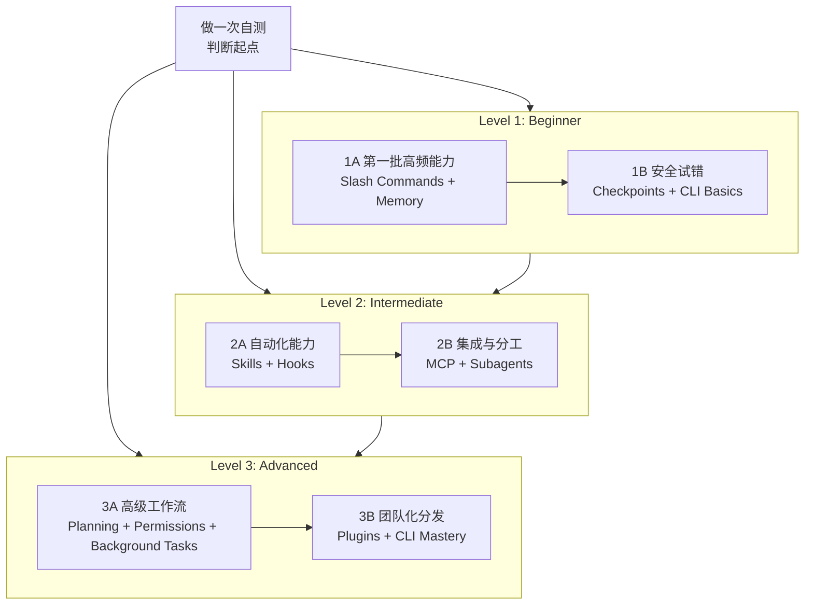

<picture>
  <source media="(prefers-color-scheme: dark)" srcset="resources/logos/claude-howto-logo-dark.svg">
  
</picture>

# Claude Code 学习路线图

如果你刚接触 Claude Code，这份路线图的目标不是让你一次看完全部功能，而是帮你判断：

- 你现在在哪个阶段
- 应该先学什么
- 哪些内容值得今天就开始动手
- 哪些能力适合等基础打稳后再学

---

## 🧭 先判断你的起点

先快速勾选下面这些项目：

- [ ] 我会启动 Claude Code，并能正常对话（`claude`）
- [ ] 我创建过或修改过 `CLAUDE.md`
- [ ] 我用过至少 3 个内建 slash commands（例如 `/help`、`/compact`、`/model`）
- [ ] 我创建过自定义 slash command 或 skill（`SKILL.md`）
- [ ] 我配置过一个 MCP server
- [ ] 我在 `~/.claude/settings.json` 里配置过 hooks
- [ ] 我用过或创建过 subagents（`.claude/agents/`）
- [ ] 我用过 print mode（`claude -p`）做脚本或 CI/CD

### 你的推荐起点

| 勾选数 | 你现在的阶段 | 从哪里开始 | 预计时间 |
|--------|--------------|------------|----------|
| 0-2 | Level 1：Beginner | [里程碑 1A](#-里程碑-1a第一批高频能力) | 约 3 小时 |
| 3-5 | Level 2：Intermediate | [里程碑 2A](#-里程碑-2a自动化能力) | 约 5 小时 |
| 6-8 | Level 3：Advanced | [里程碑 3A](#-里程碑-3a高级工作流) | 约 5 小时 |

如果你不确定，就从更低一级开始。Claude Code 的很多高级能力都建立在目录结构、上下文加载和工具权限这些基础之上。

如果你已经把 `.claude/skills/self-assessment` 安装到 Claude Code，也可以直接运行 `/self-assessment` 做交互式自测。

---

## 🎯 学习原则

本仓库推荐的学习顺序，不是按“功能列表”排的，而是按以下原则排的：

1. **先学最常用的能力**
2. **先学依赖更少的能力**
3. **先学能立刻给你回报的能力**

也就是说，你不需要一上来就学 MCP、plugins 或 agent teams。先把 slash commands、memory、CLI、checkpoints 这些基本功打稳，后面会轻松很多。

---

## 🗺️ 推荐学习路径



---

## 📊 完整路线总表

| 顺序 | 模块 | 推荐阶段 | 时间 | 你学完会得到什么 |
|------|------|----------|------|------------------|
| 1 | [Slash Commands](01-slash-commands/) | Beginner | 30 分钟 | 立即获得一些高频快捷操作 |
| 2 | [Memory](02-memory/) | Beginner | 45 分钟 | 学会让 Claude 记住项目规则和个人偏好 |
| 3 | [Checkpoints](08-checkpoints/) | Beginner+ | 45 分钟 | 敢于试错，知道怎么安全回退 |
| 4 | [CLI Basics](10-cli/) | Beginner+ | 30 分钟 | 会用 `claude` 和 `claude -p` 处理脚本与终端场景 |
| 5 | [Skills](03-skills/) | Intermediate | 1 小时 | 学会把常见工作流做成可复用能力 |
| 6 | [Hooks](06-hooks/) | Intermediate | 1 小时 | 学会做自动检查、自动提醒、自动拦截 |
| 7 | [MCP](05-mcp/) | Intermediate+ | 1 小时 | 学会让 Claude 接 GitHub、数据库、文件系统等外部能力 |
| 8 | [Subagents](04-subagents/) | Intermediate+ | 1.5 小时 | 学会任务拆分和专业分工 |
| 9 | [Advanced Features](09-advanced-features/) | Advanced | 2-3 小时 | 掌握 plan、权限模式、background tasks 等高级能力 |
| 10 | [Plugins](07-plugins/) | Advanced | 2 小时 | 学会把 commands / hooks / MCP / subagents 打包成一套方案 |
| 11 | [CLI Mastery](10-cli/) | Advanced | 1 小时 | 会做自动化、脚本化、CI/CD 集成 |

**总学习时间**：约 11-13 小时。  
如果你不是从零开始，可以直接跳到适合自己的阶段。

---

## 🟢 里程碑 1A：第一批高频能力

**适合谁**：几乎没用过 Claude Code，或者只会聊天  
**目标**：先拿到最快的收益，不求全面，但求能上手

### 你要学什么

- [Slash Commands](01-slash-commands/)
- [Memory](02-memory/)

### 你学完会得到什么

- 会安装和调用一个自定义 slash command
- 知道 `CLAUDE.md` 是什么，什么时候该放项目规则、什么时候放个人偏好
- 知道 Claude Code 为什么“有时记得，有时不记得”

### 建议动手练习

```bash
# 1. 安装一个 slash command
mkdir -p .claude/commands
cp 01-slash-commands/optimize.md .claude/commands/

# 2. 安装项目 memory
cp 02-memory/project-CLAUDE.md ./CLAUDE.md

# 3. 打开 Claude Code 试用
# /optimize
```

### 自检标准

- [ ] 我能成功使用 `/optimize`
- [ ] 我知道 `CLAUDE.md` 会自动加载
- [ ] 我能说清 slash commands 和 memory 的区别

---

## 🟢 里程碑 1B：安全试错

**适合谁**：已经会一些基础操作，但还不敢让 Claude 直接改东西  
**目标**：学会可回退地试验，避免越用越紧张

### 你要学什么

- [Checkpoints](08-checkpoints/)
- [CLI Basics](10-cli/)

### 你学完会得到什么

- 知道 checkpoints 是怎么帮助你安全试错的
- 知道什么时候用交互模式，什么时候用 `claude -p`
- 知道如何把终端输出通过 pipe 交给 Claude 分析

### 建议动手练习

```bash
# 在 Claude Code 里做一个小修改
# 如果不满意，按 Esc + Esc 或使用 /rewind

claude "explain this project"
claude -p "explain this function"
cat error.log | claude -p "explain this error"
```

### 自检标准

- [ ] 我成功回退过一次 checkpoint
- [ ] 我用过交互模式和 print mode
- [ ] 我知道为什么 `claude -p` 很适合脚本和 CI/CD

---

## 🔵 里程碑 2A：自动化能力

**适合谁**：已经会一些命令和 `CLAUDE.md`，但工作流还比较手动  
**目标**：让 Claude 逐步帮你自动做重复任务

### 你要学什么

- [Skills](03-skills/)
- [Hooks](06-hooks/)

### 你学完会得到什么

- 会写 `SKILL.md`
- 知道哪些事情适合做成自动触发的 skills
- 会在关键事件上配置 hooks 做提醒、拦截、格式化和安全检查

### 中国用户特别注意

- `hooks` 里的 shell 命令和路径不要翻译
- Windows 用户优先确认是在 PowerShell、Git Bash 还是 WSL 下运行
- 依赖 `python` / `bash` / `node` 的脚本，先确认本机路径和环境变量

### 建议动手练习

```bash
# 安装一个 skill
mkdir -p ~/.claude/skills
cp -r 03-skills/code-review-specialist ~/.claude/skills/

# 安装一个 hook 脚本
mkdir -p ~/.claude/hooks
cp 06-hooks/pre-commit.sh ~/.claude/hooks/
chmod +x ~/.claude/hooks/pre-commit.sh
```

这里使用 `code-review-specialist` 是为了避开 Claude Code `v2.1.146+` 内置的 `/code-review` 命令；不要把这个示例 skill 随手改回 `code-review`。

---

## 🔵 里程碑 2B：集成与分工

**适合谁**：已经会基本自动化，准备让 Claude 接外部工具并分工协作  
**目标**：让 Claude 不只会“说”，还会“查”和“分工”

### 你要学什么

- [MCP](05-mcp/)
- [Subagents](04-subagents/)

### 你学完会得到什么

- 知道 MCP 为什么能让 Claude 接 GitHub、数据库、文件系统等能力
- 知道 subagents 什么时候比一个大 prompt 更有效
- 会配置基础的 MCP server 和常用 subagent

### 中国用户特别注意

- GitHub 相关 MCP 往往需要先有可用的 `GITHUB_TOKEN`
- 某些基于 `npx` 的 MCP server 首次安装会比较慢，要提前考虑网络和代理
- 如果你使用的是 Windows，优先关注文档里关于 `cmd /c`、WSL 和 shell 的差异提示

---

## 🔴 里程碑 3A：高级工作流

**适合谁**：已经可以独立使用 Claude Code 解决项目问题  
**目标**：掌握高复杂度工作流里的控制力

### 你要学什么

- [Advanced Features](09-advanced-features/)

### 你学完会得到什么

- 会用 planning mode 做复杂任务规划
- 理解 permission modes 的差异
- 会用 background tasks、scheduled tasks、sessions、worktrees 等高级能力

### 建议重点理解

- `default` / `acceptEdits` / `plan` / `dontAsk` / `bypassPermissions`
- `claude -p` 在自动化里的边界
- Auto Mode 适合什么，不适合什么

---

## 🔴 里程碑 3B：团队化分发

**适合谁**：希望把自己的工作流推广给团队使用  
**目标**：把“个人技巧”做成“团队标准能力”

### 你要学什么

- [Plugins](07-plugins/)
- [CLI Reference](10-cli/)

### 你学完会得到什么

- 会把 commands、skills、hooks、MCP、subagents 组合成 plugin
- 会把 Claude Code 接进脚本、CI/CD 和团队自动化流程
- 会维护一套可分发、可版本化的团队方案

---

## 推荐学习顺序总结

### 如果你是纯新手

1. `01-slash-commands`
2. `02-memory`
3. `08-checkpoints`
4. `10-cli`

### 如果你已经会一点

1. `03-skills`
2. `06-hooks`
3. `05-mcp`
4. `04-subagents`

### 如果你要做团队级方案

1. `09-advanced-features`
2. `07-plugins`
3. `10-cli`

---

## 下一步怎么走

- 想直接开始复制配置：看 [QUICK_REFERENCE.md](QUICK_REFERENCE.md)
- 想整体浏览能力地图：看 [CATALOG.md](CATALOG.md)
- 想理解本中文 fork 的边界和同步方式：看 [UPSTREAM.md](UPSTREAM.md)
- 想继续做中文化贡献：看 [LOCALIZATION-STYLE.md](LOCALIZATION-STYLE.md)
